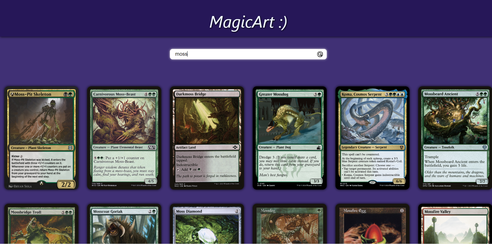

## MagicArt

An application to search for MagicCards

## Project Screen Shot(s)

## Installation and Setup Instructions

Clone down this repository. You will need `node` and `npm` installed globally on your machine.  

Installation:

`npm install`  

To Run Test Suite:  

`npm test`  

To Start Server:

`npm start`  

To Visit App:

`localhost:3000`  

## Features and Description

I used "create-react-app" boilerplate and javascript to create this app. This app uses `setState` and `useEffect` to pass around information and create dynamic elements on the page. The main components are a *Search Bar*, *Search Results Suggestion List*, and an area for the Search results to be displayed. Search results are grabbed from the *Scryfall API*(https://scryfall.com/docs/api). Typing in the search bar automatically creates a search result list where you can click on any of the options and see what that results card information and art look like. Alternatively you can hit `Enter` or click the button in the search bar to give the card png's for each card in the return array. From there you can click on any card to get the specific card's information and art. I plan on being able to click the artist to pull every card they have illustrated for.
